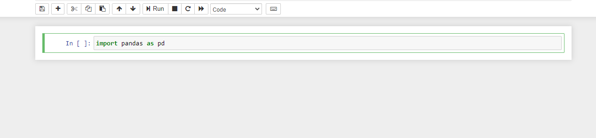

O projeto Jupyter é outra ferramenta que é muito importante no nosso ferramental de análise de dados.

O nome é uma referência às 3 principais linguagens suportadas pelo projeto - Julia, Python e R.

E o termo notebook é uma referência aos cadernos de anotação de Galilei que registram a descoberta das luas de jupiter. [Wikipedia](https://pt.wikipedia.org/wiki/Projeto_Jupyter "Wikipedia Jupyter").

Para instalar também é muito simples:

```
C:\python_projects\introducao-pandas>pipenv install jupyter
```

Esse comando irá instalar o jupyter e todas as dependências por ele usadas.

Para abrir o jupyter notebook executamos o comando abaixo com o ambiente virtual ativado:


```
(introducao-pandas) C:\python_projects\introducao-pandas>jupyter notebook

```

Após isso conseguiremos executar célula a célula os nossos scripts, sendo mais fácil assim analisarmos os resultados de nosso programa.


